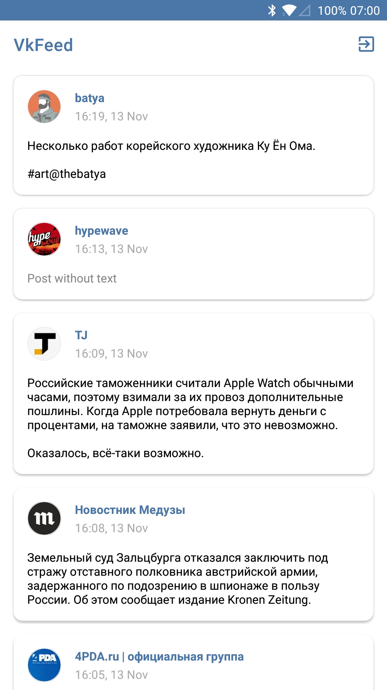
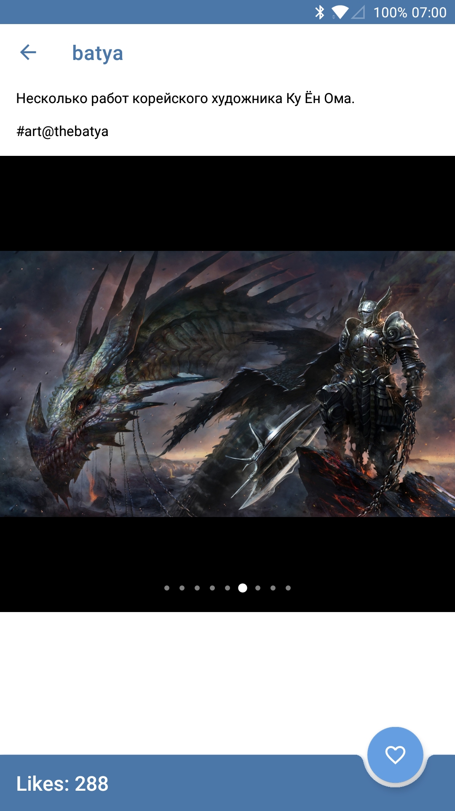
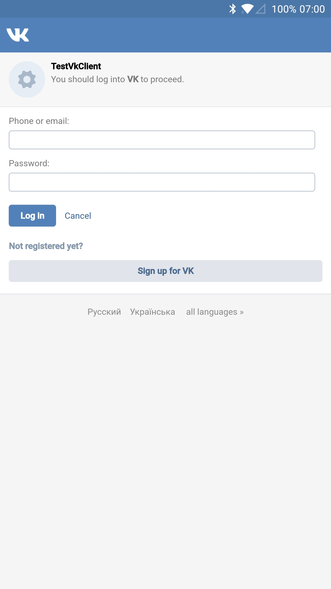

# VkFeed
Демонстрационный Android-клиент на основе API ВКонтакте

  

## В проекте реализованы:
- MVP-паттерн
- Splash экран
- Экран входа (без использования VK SDK)
- Экран с новостной лентой
- Экран с деталями поста
- Возможность поставить/убрать лайк записи
- Обработка случаев, когда нет интернета
- Поддержка Android 4.1+
- Unit-тесты

## В проекте используются:
- [RxJava2](https://github.com/ReactiveX/RxJava) и [RxAndroid](https://github.com/ReactiveX/RxAndroid)
- [Retrofit](http://square.github.io/retrofit)
- [Dagger 2](http://google.github.io/dagger)
- [Gson](https://github.com/google/gson)
- [Picasso](http://square.github.io/picasso)
- [AssertJ](https://github.com/joel-costigliola/assertj-core)
- [Mockito](https://github.com/mockito/mockito)
- [CircleIndicator](https://github.com/ongakuer/CircleIndicator)

[Старая версия](https://github.com/hotmule/VkFeedOld)
